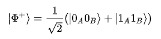

# dense

## Problem

> CSAW goes superdense for once

[message.txt](message.txt)

## Solution

The contents of `message.txt` seem to be related to quantum computation, judging by the reference to "entagled pairs".

The only hint we are given is the word "superdense". Googling that leads to the [Wikipedia article on Superdense coding](https://en.wikipedia.org/wiki/Superdense_coding), which tells us that **superdense coding is a quantum communication protocol for for transmitting 2 classical bits of information**.
Since `message.txt` seems to describe the transmission of a message using this protocol, we can look at the [Preparation](https://en.wikipedia.org/wiki/Superdense_coding#Preparation) and [Encoding](https://en.wikipedia.org/wiki/Superdense_coding#Encoding) sections of the Wikipedia article in order to understand what was done in order to encode the message.

The Preparation section on Wikipedia states that the protocol starts with the preparation of an entangled state, which is shared between the 2 parties. An example of such an entangled state is given. Interestingly enough, the example on Wikipedia is exactly the same as the entangled pair given in `message.txt`:

The Encoding section describes how a quantum gate, represented as a matrix, is applied to the qubit the sender wants to transmit. Luckily for us, we don't need to know how the math works, since the Wikipedia article shows the resultant entangled state for transmitting every one of the possible 2-bit strings (`00`, `01`, `10`, `11`), using the same initial entangled state as the one we have in `message.txt`. Therefore, all we have to do is go through the list of entangled states in `message.txt`, compare them with the ones in the Wikipedia example, and identify whether they represent `00`, `01`, `10` or `11`. We then convert the final sequence of bits to ASCII.

[Python script](solver.py)