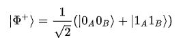

# dense

## Problem

> CSAW goes superdense for once.

[message.txt](message.txt)

## Solution

The contents of `message.txt` seem to be related to quantum computation, judging by the reference to “entangled pairs”.

The only hint we are given is the word “superdense”. Googling that leads to the [Wikipedia article on superdense coding](https://en.wikipedia.org/wiki/Superdense_coding).

Since `message.txt` seems to describe the transmission of a message using this protocol, we can look at the [Preparation](https://en.wikipedia.org/wiki/Superdense_coding#Preparation) and [Encoding](https://en.wikipedia.org/wiki/Superdense_coding#Encoding) sections of the Wikipedia article to understand what was done to encode the message.

The Preparation section on Wikipedia states that the protocol starts with the preparation of an entangled state, which is shared between the two parties. An example of such an entangled state is given. Interestingly enough, the example on Wikipedia is identical to the entangled pair given in `message.txt`:

The Encoding section describes how a quantum gate, represented as a matrix, is applied to the qubit the sender wants to transmit. Luckily, we don’t need to know how the math works. The Wikipedia article provides the resultant entangled state for transmitting all possible 2-bit strings (`00`, `01`, `10`, `11`), using the same initial entangled state as the one in `message.txt`. Therefore, all we have to do is go through the list of entangled states in `message.txt`, compare them with the ones in the Wikipedia example, and identify whether they represent `00`, `01`, `10`, or `11`. We then convert the final sequence of bits to ASCII.

[Python script](solver.py)
