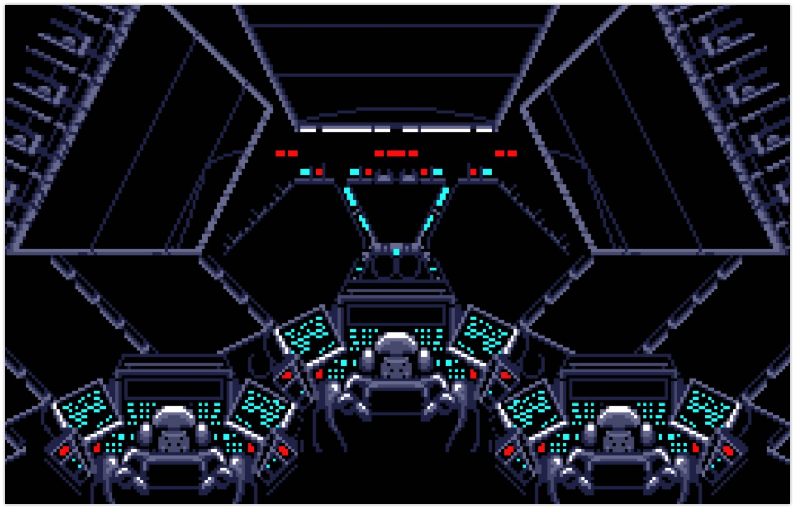

# Deep mid-space

## Problem

> Suddenly, in the silence of the control room, a strange music can be heard, but none of the space team have put it on.  
R-boy is on his way to find out what the heck is going on.

## Solution

For this challenge, we are given a website which is playing the [2001: A Space Odyssey](https://en.wikipedia.org/wiki/2001:_A_Space_Odyssey_(film)) soundtrack.

Looking at the source code, we find the soundtrack file, `2001.mid`.

One way to hide messages in MIDI files is using the "Program change" message. This is a type of event which does not correspond to any audio, but instead is used to control device configurations.

We downloaded [stegano_midi](https://github.com/maxcruz/stegano_midi), a program which performs MIDI steganography using the method mentioned above. We made it into an executable, and used the command `stegano_midi --reveal --file=2001.mid` to reveal the message hidden in the file, if any.

Fortunately, we obtained a base-64-encoded string, which, when decoded, resulted in the flag.

*NB: Since the website for this challenge is not up anymore, we included the MIDI file along with this write-up.*

[2001.mid](2001.mid)
