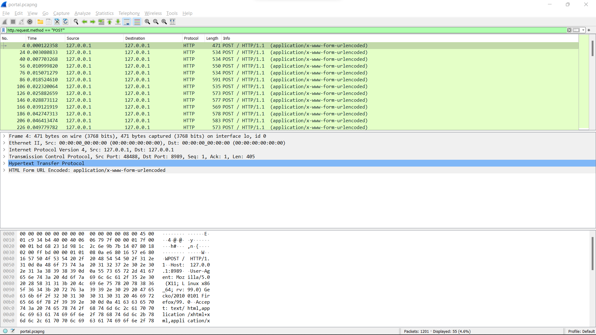
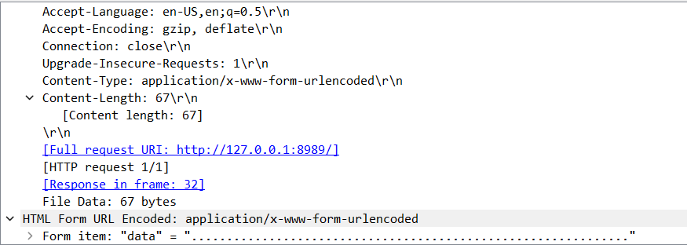

# The Citadel of Ricks

## Problem

We were given a `pcapng` file with a packet dump.

[portal.pcapng](portal.pcapng)

## Solution

I opened the file with Wireshark and saw that it contains around 1200 TCP, HTTP and DNS packets.

The HTTP packets caught my attention immediately because many of them were POST requests. I added the filter `http.request.method == "POST"` to see only the POST packets.



It turned out that a bunch of dots was being POSTed each time:



The content length of the data being POSTed quickly caught my attention. Being a CTF player, I know that the decimal representation of upper-case characters in ASCII lies in the range `\[65&ndash;90\]` and lower-case characters in the range `\[97&ndash;122\]`. Most of the numbers were in these ranges, so I figured that this has to be the flag.

I wrote the following bash one-liner to get the flag:

```bash
strings portal.pcapng | grep "data=" | tail -n +2 | grep -o '[adt=.]*' | awk '{print length}' | while read -r line; do printf \\$(printf "%o" $line); done;
```

Explanation:

- `strings portal.pcapng`: Prints all the printable-character strings in the `pcapng` file, one on each line.
- `grep "data="`: Returns the lines that match the given pattern.
- `tail -n +2`: Removes the first line, which was an empty message.
- `grep -o '[adt=.]*'`: Keeps only the characters that match the pattern (there were some irrelevant characters on some lines).
- `awk '{print length}'`: Prints the character length of each line.
- `while read -r line; do printf \\$(printf "%o" $line); done;` Reads line by line and converts each line from decimal to an ASCII character (`printf` cannot do this directly so we first convert from decimal to octal and then from octal to ASCII character).
