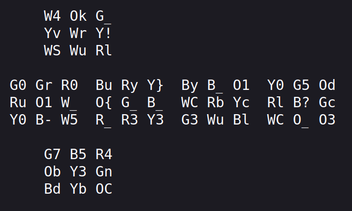
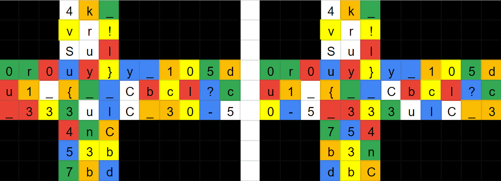
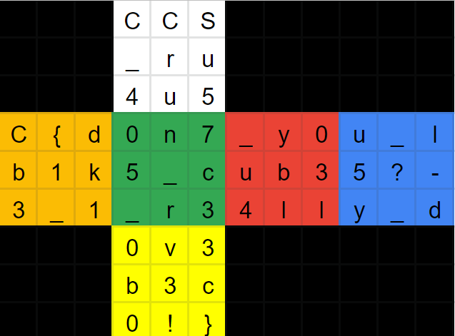

# CUBIK RICK

## Problem

We were given a webpage with the following text:

## Solution

It was obvious that this was the representation of the faces of a 3x3 cube. In the beginning, I mistook the “O” characters for “0”s because they look narrow in this font. However, I then realized that there were some “0” characters which looked different. Once I became aware of this, I realized that we were talking about a Rubik’s cube. I had also missed a hint in the challenge title with the spelling of the word “cubic”.

The first character in each pair of characters represents a color on the Rubik’s cube. So, this was a scrambled Rubik’s cube and solving it will probably reveal the flag. If I had a physical Rubik’s cube available, I could have put some stickers on it with the letters and solved it. But I didn’t.

I found a website called Rubik’s Cube Solver and gave it the Rubik’s cube colors: https://rubiks-cube-solver.com/solution.php?cube=0123616114334421651546235446552146315632453122354263562

Every scrambled Rubik’s cube can be solved in 20 moves or less. Unfortunately, this one required the maximum of 20 moves. The good news was that the website had a “Flat View” which showed how each move looked like on a 2D representation of the cube, which was what we were given in this challenge.

I created a spreadsheet with the scrambled state of the Rubik’s cube:

Then, I went through the moves to solve the cube one by one, keeping track of the current and previous states. For example, after the first move:

It was a tedious process, but I managed to speed things up a bit by using the Paste Transposed feature of the spreadsheet program when working through some of the moves.

In the end, I got the flag as expected:

