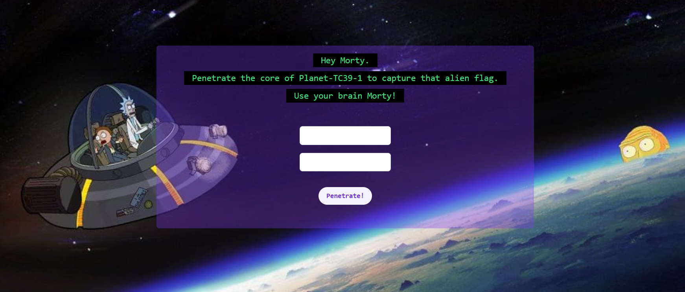

# Planet TC-39 \#1

## Problem

[app.js](app.js)

## Solution

We were given a webpage that looks like this:

We can insert 2 values, which are then POSTed to the back end. I used the Edit and Resend feature (Replay XHR in Chrome) to experiment with sending the payload directly, skipping any client-side validation or changes in the values.

We were given the back-end source code. Looking at the code, I saw that the 2 values are extracted from the payload. Then, the program exits if the values are not equal, or if the [reciprocals](https://en.wikipedia.org/wiki/Multiplicative_inverse) of the two values are equal. In other words, we need 2 values `a` and `b` where `a === b` but `1/a !== 1/b`.

After trying out a few things in my browser console, I found that `var a = 'a'` and `var b = 'a'` satisfy these conditions. `1/'a' === 1/'a'` returns `false` because `1/'a'` resolves to `NaN`, and `NaN === NaN` returns `false`.
